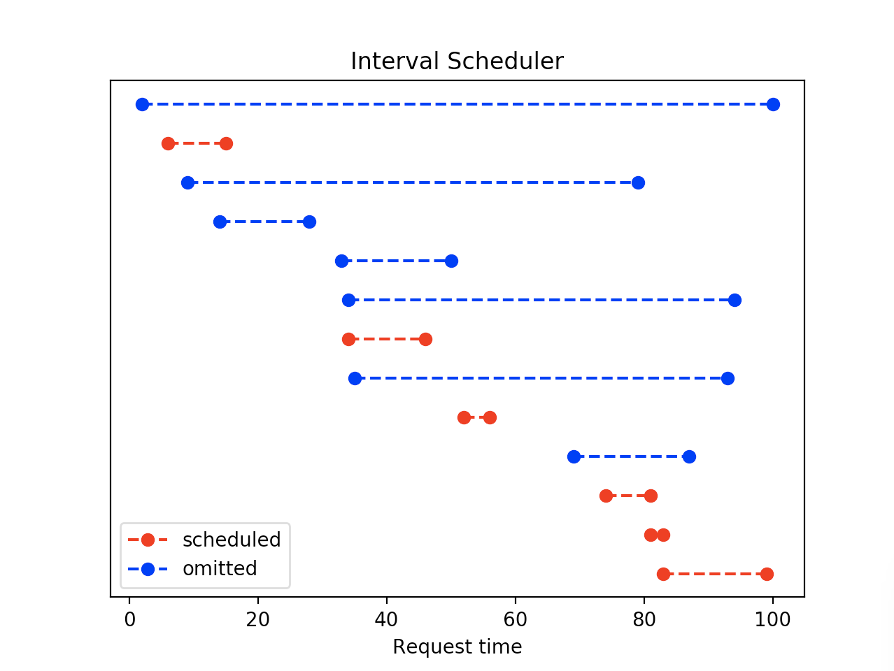

# Interval_scheduler

## Description
This is a demonstration of an interval scheduler that creates an optimal scheduler (maximized number of scheduled requests)  by using earliest finish time as the heuristic to schedule next requests. This demonstration assumes all requests are weighted equally.

A valid request is such that the start time is less than the end time. Compatible requests are two requests for which the end time of one is less than or equal to the start time of the other.

## Run instructions
To run:
```python interval_scheduling.py <modeFlag> <filename.txt>```

modeFlags:
  ```
  [0] randomize the request intervals
  [1] manually input request intervals by command line prompt 
  [2] upload a file containing requests. Requires filename to be specified in the arguments.
  ```
If no modeFlag is specified, the program defaults to modeFlag 0.
Only modeFlag 2 requires a file to be specified. Other modes will not check for the filename argument.

If using modeFlag 2, the file should be formatted with each interval on its own line. The program will automatically parse spaces, tabs, and commas. A sample file is included.

## Output
After scheduling, the program will display a visualization of the scheduled requests via text and by a plot.

